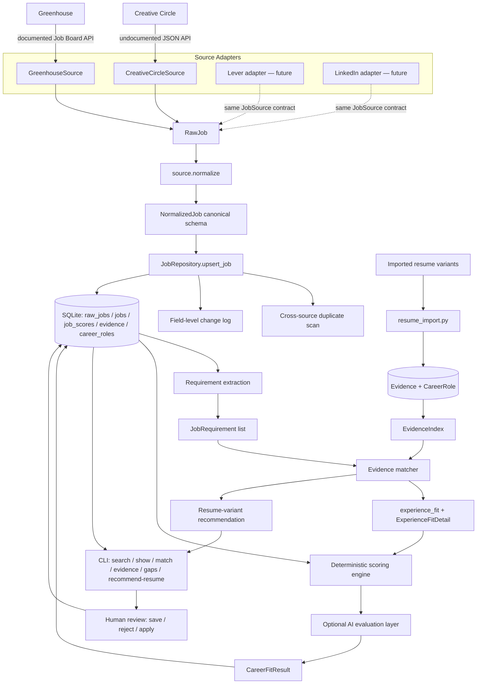

# Architecture

## Principle

**Sources change. The career model should not.**

Creative Circle is an implementation detail at the edge of the system.
Everything after normalization — dedup, scoring, storage, review, and
(eventually) application/interview support — works identically regardless
of whether a job came from Creative Circle, Greenhouse, Lever, LinkedIn, a
company careers page, or manual entry. No package outside
`sources/<name>/` is permitted to import anything from inside one.

## Pipeline (Phase 2)



Every source adapter plugs in at the same point (producing `RawJob` via
the `JobSource` contract) and nothing downstream needs to change — proven
in practice by adding Greenhouse without touching `domain/`, `storage/`,
or `scoring/` (see docs/sources/greenhouse.md's "second-source
validation" section for what *did* need to flex, and where it lived).
The new element in Phase 2 is the evidence layer running alongside
scoring: **jobs are matched against evidence, not just keywords** — see
docs/evidence-model.md.

## Layers

```
src/careers_os/
  domain/            canonical, source-agnostic models
    enums.py           RemoteStatus, EmploymentType, JobStatus, SourceHealthStatus
    query.py           JobSearchQuery (source-agnostic search request)
    raw_job.py         RawJob (verbatim-as-practical source data)
    job.py             NormalizedJob (canonical schema)
    scoring.py         FitComponent, CareerFitResult
    taxonomy.py        SkillCategory — shared by requirements and evidence
    requirements.py    JobRequirement
    evidence.py        Evidence, EvidenceProvenance
    resume.py          CareerRole, RoleFraming, ProjectEvidenceEntry, ResumeVariant
    matching.py        MatchType, GapType, RequirementMatch, EvidenceRef
    experience.py       ExperienceFitDetail, YearsEstimate

  sources/
    base.py            JobSource ABC every adapter implements + SourceHealth
    creative_circle/   first adapter — all CC-specific code lives here only
      constants.py, client.py, parser.py, source.py
    greenhouse/        second adapter — all Greenhouse-specific code lives here only
      constants.py, client.py, parser.py, source.py, config.py, boards.yaml

  career/              what I'm targeting, and what I've done — configuration + parsing, not scoring logic
    profile.py, preferences.py, data/profile.yaml, data/preferences.yaml
    skills.py            loads data/skills_taxonomy.yaml
    resume_import.py     deterministic DOCX -> CareerRole/RoleFraming/Evidence
    timeline.py           interval merging, years-of-experience estimation
    resume_recommendation.py

  scoring/
    deterministic.py    rule-based, explainable component scorers (role/technical/career-direction/comp/work-arrangement + the no-resume experience_fit fallback)
    requirements.py       deterministic job-requirement extraction
    evidence_matcher.py   EvidenceIndex + match_requirement + real experience_fit
    ai.py                optional LLM refinement (no-ops without an API key; role_fit/career_direction_fit only)
    engine.py            combines deterministic (+ optional evidence + optional AI) -> CareerFitResult

  storage/
    db.py                SQLAlchemy models: jobs, raw_jobs, job_scores, resume_variants,
                          career_roles, role_framings, project_evidence, evidence,
                          possible_duplicates, job_changes
    repository.py        JobRepository — dedup + status-preserving upsert + change log + duplicate scan
    resume_repository.py ResumeRepository — resume/evidence persistence + EvidenceIndex loading
    dedup.py             conservative cross-source duplicate signal scoring

  ingestion/
    pipeline.py          search -> normalize -> upsert -> score (with evidence), in one place

  observability/
    logging.py           structured (JSON-line) logging

  cli.py                 `jobs search creative-circle|greenhouse|greenhouse-all`, `list`, `show`,
                          `match`, `evidence`, `gaps`, `recommend-resume`, `duplicates`, `history`,
                          `status`, `health`; `careers import-resume`, `resumes`, `experience`
```

## Deduplication

Primary identity is `(source, source_job_id)` — enforced by
`JobRepository.upsert_job`, which looks up an existing row by that pair
before deciding whether to insert or update. Exact, cheap, and sufficient
for same-source re-syncs.

Cross-source deduplication (the same real-world job posted through two
different sources) is fuzzier and handled separately by
`storage/dedup.py::compare_jobs`, run once per newly-discovered job
against every job from a *different* source. It only ever **flags** a
`PossibleDuplicateRecord` for human review (`jobs duplicates`) — nothing
merges or deletes automatically. A title match alone is never enough to
flag anything; flagging requires either (normalized title + normalized
company both match) or a strongly similar description
(`difflib.SequenceMatcher` ratio ≥ 0.75). This is a deliberately
conservative first pass, not a real entity-resolution system — see
docs/scoring.md-adjacent honesty principle: better to under-flag than to
silently conflate two different postings.

## Job lifecycle

```
new -> reviewing -> saved -> planning_to_apply -> applied -> interviewing -> offer -> closed
                 \-> rejected
```

`status` is the one field on a job record that ingestion is never allowed
to touch. `JobRepository.upsert_job` refreshes every other field from the
source and leaves `status`, `first_seen_at`, and the row's identity alone.
This is covered directly by `tests/test_repository_dedup.py::test_upsert_preserves_human_set_status_across_resync`.

## Change tracking

Each `JobRecord` carries `first_seen_at`, `last_seen_at`, and
`source_updated_at` (Phase 1). Phase 2 adds a real, append-only
`JobChangeRecord` log: `JobRepository.upsert_job` diffs `description`,
`location`, and a combined `compensation` summary (salary/hourly, whichever
applies) against the stored values on every re-sync of an *existing* job,
and records exactly what changed (`jobs history <source> <id>`).

`raw_jobs` still keeps only the latest snapshot per job, not a full
append-only raw-payload history — the change log above captures the
*normalized* fields that actually matter for a human deciding whether to
revisit a job, without the storage cost of versioning every raw API
response.

**Deliberately still not built**: closure detection. If a job disappears
from a search result, that is not treated as evidence it closed — it could
be pagination, a filter change, or (for Creative Circle specifically) the
documented approximate `daysPosted` behavior. Only a direct job-detail
fetch confirming inactive status should ever be trusted for that, and
nothing here runs that check proactively yet. This remains a Phase 3 item
(see below), now that scheduled re-checking is closer to being worth
building.

## Source health

`JobSource.health()` returns a `SourceHealth` with `healthy` / `degraded` /
`broken`, derived from request and parse failure counts accumulated during
the adapter's lifetime (see `CreativeCircleSource.health`). This is
intentionally simple for one source; a future multi-source scheduler would
aggregate these to decide which sources to trust or skip.

## Recommended Phase 3

Phase 2 delivered: a second source (Greenhouse), a structured resume/
evidence model with provenance, a real deterministic `experience_fit`
replacing the placeholder, requirement-vs-evidence matching with an
explicit gap taxonomy, resume-variant recommendation, conservative
cross-source duplicate flagging, and field-level change tracking. Roughly
in priority order for what's next:

1. **AI-assisted evidence reasoning, with real guardrails.** The
   deterministic matcher is intentionally literal (exact taxonomy alias
   matching only — see docs/evidence-model.md's PHP/Laravel example of
   honest under-counting). An AI layer that reasons about adjacent-skill
   similarity, explains transferable experience, or helps resolve
   `unknown`-category (non-taxonomy) requirements would add real value —
   *if* it's required to cite specific evidence IDs for every claim and is
   structurally prevented from upgrading a citation-less claim to a match
   (mirroring how `scoring/ai.py` already can't touch `experience_fit` at
   all today).
2. **Scheduled ingestion + closure detection.** Now that there are two
   real sources and change tracking, a daily scheduled sync plus a
   direct-fetch closure check (rather than inferring closure from a
   missing search hit) becomes worth the complexity.
3. **A third source with a materially different shape** (e.g. Lever, or a
   plain company careers page with no API at all) to further stress-test
   the `JobSource` abstraction — Greenhouse validated "documented API, no
   server-side filtering"; a scrape-only source would validate the
   opposite end of the spectrum.
4. **Portfolio/GitHub evidence sources.** `EvidenceProvenance.source_type`
   already supports `"portfolio"` and `"github"` — only the resume
   importer exists today. A GitHub-repo evidence importer would let
   `technical_fit`/`experience_fit` draw on real shipped code, not just
   resume prose.
5. **Company intelligence** — enrich `NormalizedJob.company` with an
   external lookup (funding, engineering culture signals, tech stack) once
   there's a reason to trust a given company field consistently across
   sources.
6. **Resume-language gap remediation** — since `resume_language_gap` is
   already a distinct, machine-identified category (docs/evidence-model.md),
   a natural next feature is suggesting the actual bullet rewrite that
   would close it, rather than just flagging that one exists.
