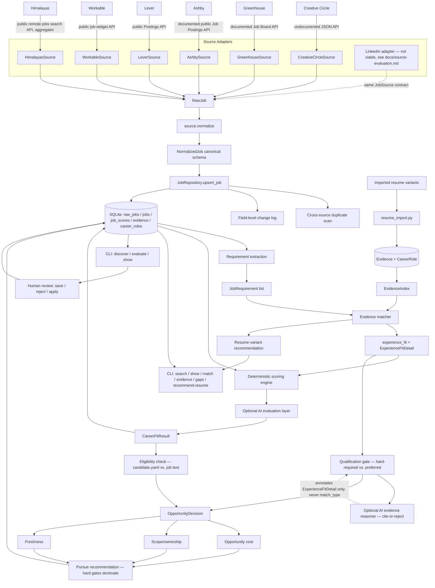

# Architecture

## Principle

**Sources change. The career model should not.**

Creative Circle is an implementation detail at the edge of the system.
Everything after normalization — dedup, scoring, storage, review, and
(eventually) application/interview support — works identically regardless
of whether a job came from Creative Circle, Greenhouse, Lever, LinkedIn, a
company careers page, or manual entry. No package outside
`sources/<name>/` is permitted to import anything from inside one.

## Pipeline (Phase 3)



Every source adapter plugs in at the same point (producing `RawJob` via
the `JobSource` contract) and nothing downstream needs to change — proven
in practice by adding Greenhouse without touching `domain/`, `storage/`,
or `scoring/` (see docs/sources/greenhouse.md's "second-source
validation" section for what *did* need to flex, and where it lived).
Phase 2 added the evidence layer running alongside scoring: **jobs are
matched against evidence, not just keywords** (docs/evidence-model.md).
Phase 3 adds the decision layer on top of that: **a good match is not the
same question as whether it's worth pursuing** — eligibility,
qualification, and opportunity cost each can independently override an
otherwise-strong fit (docs/eligibility.md, docs/pursue-recommendation.md).

## Layers

```
src/careers_os/
  domain/            canonical, source-agnostic models
    enums.py           RemoteStatus, EmploymentType, JobStatus, SourceHealthStatus
    query.py           JobSearchQuery (source-agnostic search request)
    raw_job.py         RawJob (verbatim-as-practical source data)
    job.py             NormalizedJob (canonical schema)
    scoring.py         FitComponent, CareerFitResult
    taxonomy.py        SkillCategory — shared by requirements and evidence
    requirements.py    JobRequirement
    evidence.py        Evidence, EvidenceProvenance
    resume.py          CareerRole, RoleFraming, ProjectEvidenceEntry, ResumeVariant
    matching.py        MatchType, GapType, RequirementMatch, EvidenceRef, AIAssessmentType
    experience.py       ExperienceFitDetail, YearsEstimate
    eligibility.py       EligibilityStatus, EligibilityCheck, EligibilityResult
    qualification.py     QualificationStatus, QualificationResult
    opportunity_decision.py  OpportunityCost/Scope/Freshness/Pursue results, OpportunityDecision

  sources/
    base.py            JobSource ABC every adapter implements + SourceHealth
    creative_circle/   first adapter — all CC-specific code lives here only
      constants.py, client.py, parser.py, source.py
    greenhouse/        second adapter — all Greenhouse-specific code lives here only
      constants.py, client.py, parser.py, source.py, config.py, boards.yaml
    ashby/             third adapter — all Ashby-specific code lives here only
      constants.py, client.py, parser.py, source.py, config.py, boards.yaml
    lever/             fourth adapter — all Lever-specific code lives here only
      constants.py, client.py, parser.py, source.py, config.py, companies.yaml
    workable/          fifth adapter — all Workable-specific code lives here only
      constants.py, client.py, parser.py, source.py, config.py, accounts.yaml
    himalayas/         sixth adapter, first aggregator with keyword search
      constants.py, client.py, parser.py, source.py
    authority.py       which sources are aggregators vs. employer postings

  career/              what I'm targeting, what I've done, and what I'll accept — config + parsing, not scoring logic
    profile.py, preferences.py, candidate.py    data/profile.yaml, data/preferences.yaml, data/candidate.yaml
    skills.py            loads data/skills_taxonomy.yaml
    resume_import.py     deterministic DOCX -> CareerRole/RoleFraming/Evidence
    timeline.py           interval merging, years-of-experience estimation
    resume_recommendation.py
    search_profiles.py    data/search_profiles.yaml — configurable discovery queries
    bridge_role.py         category-presence bridge-role classification
    opportunity_value.py   immediate-opportunity / career-direction assessment
    discovery_ranking.py   multi-dimension rank score for `jobs discover`
    eligibility.py         deterministic hard-constraint evaluation (timezone, auth, clearance, ...)
    opportunity_cost.py    high/moderate/low/unknown opportunity-cost classification
    scope.py               execution/ownership/architecture/... scope classification
    applications.py        committed applied/ruled-out list read by scheduled runs
    career_track.py        stack-adjacent / career-direction track relevance (title identity + matched evidence)
    work_style.py          build-heavy / balanced / customer-heavy / coordination-heavy role-shape classification
    freshness.py           fresh/recent/aging/stale posting-age classification
    pursue.py              final pursue recommendation — hard gates dominate

  scoring/
    deterministic.py    rule-based, explainable component scorers (role/technical/career-direction/comp/work-arrangement + the no-resume experience_fit fallback)
    requirements.py       deterministic job-requirement extraction (+ RequirementImportance)
    evidence_matcher.py   EvidenceIndex + match_requirement + real experience_fit
    evidence_reasoner.py  optional AI evidence reasoner (EvidenceReasoner ABC, Claude default) — guardrailed, cite-or-reject
    qualification.py      hard-required vs. preferred qualification gating
    ai.py                optional LLM review of finalists (no-ops without an API key; role_fit/career_direction_fit only)
    engine.py            combines deterministic (+ optional evidence + optional AI) -> CareerFitResult

  storage/
    db.py                SQLAlchemy models: jobs, raw_jobs, job_scores, resume_variants,
                          career_roles, role_framings, project_evidence, evidence,
                          possible_duplicates, job_changes, job_evaluations, ai_refinements
    repository.py        JobRepository — dedup + status-preserving upsert + change log + duplicate scan +
                          evaluation persistence; job_record_to_normalized/latest_fit_from_record helpers
    resume_repository.py ResumeRepository — resume/evidence persistence + EvidenceIndex loading
    dedup.py             conservative cross-source duplicate signal scoring

  ingestion/
    pipeline.py          search -> normalize -> upsert -> score (with evidence), in one place
    discovery.py          multi-profile, multi-source discovery + ranking + per-opportunity decision
    evaluation.py          orchestrates eligibility + qualification + AI reasoning + cost/scope/freshness -> OpportunityDecision
    ai_refinement.py       bounded, cached Claude review of finalists (Phase 4.3)
    scheduled_run.py       `jobs run`: threshold -> applied/superseded removal -> AI review -> clustering -> budget -> send

  observability/
    logging.py           structured (JSON-line) logging

  cli.py                 `jobs search creative-circle|greenhouse|greenhouse-all`, `discover`, `evaluate`,
                          `list`, `show`, `match`, `evidence`, `gaps`, `recommend-resume`, `duplicates`,
                          `history`, `status`, `health`; `careers import-resume`, `resumes`, `experience`
```

## Deduplication

Primary identity is `(source, source_job_id)` — enforced by
`JobRepository.upsert_job`, which looks up an existing row by that pair
before deciding whether to insert or update. Exact, cheap, and sufficient
for same-source re-syncs.

Cross-source deduplication (the same real-world job posted through two
different sources) is fuzzier and handled separately by
`storage/dedup.py::compare_jobs`, run once per newly-discovered job
against every job from a *different* source. It only ever **flags** a
`PossibleDuplicateRecord` for human review (`jobs duplicates`) — nothing
merges or deletes automatically. A title match alone is never enough to
flag anything; flagging requires either (normalized title + normalized
company both match) or a strongly similar description
(`difflib.SequenceMatcher` ratio ≥ 0.75). This is a deliberately
conservative first pass, not a real entity-resolution system — see
docs/scoring.md-adjacent honesty principle: better to under-flag than to
silently conflate two different postings.

## Job lifecycle

```
new -> reviewing -> saved -> planning_to_apply -> applied -> interviewing -> offer -> closed
                 \-> rejected
```

`status` is the one field on a job record that ingestion is never allowed
to touch. `JobRepository.upsert_job` refreshes every other field from the
source and leaves `status`, `first_seen_at`, and the row's identity alone.
This is covered directly by `tests/test_repository_dedup.py::test_upsert_preserves_human_set_status_across_resync`.

## Change tracking

Each `JobRecord` carries `first_seen_at`, `last_seen_at`, and
`source_updated_at` (Phase 1). Phase 2 adds a real, append-only
`JobChangeRecord` log: `JobRepository.upsert_job` diffs `description`,
`location`, and a combined `compensation` summary (salary/hourly, whichever
applies) against the stored values on every re-sync of an *existing* job,
and records exactly what changed (`jobs history <source> <id>`).

`raw_jobs` still keeps only the latest snapshot per job, not a full
append-only raw-payload history — the change log above captures the
*normalized* fields that actually matter for a human deciding whether to
revisit a job, without the storage cost of versioning every raw API
response.

**Deliberately still not built**: closure detection. If a job disappears
from a search result, that is not treated as evidence it closed — it could
be pagination, a filter change, or (for Creative Circle specifically) the
documented approximate `daysPosted` behavior. Only a direct job-detail
fetch confirming inactive status should ever be trusted for that, and
nothing here runs that check proactively yet. This remains a Phase 3 item
(see below), now that scheduled re-checking is closer to being worth
building.

## Source health

`JobSource.health()` returns a `SourceHealth` with `healthy` / `degraded` /
`broken`, derived from request and parse failure counts accumulated during
the adapter's lifetime (see `CreativeCircleSource.health`). This is
intentionally simple for one source; a future multi-source scheduler would
aggregate these to decide which sources to trust or skip.

## Recommended Phase 4

Phase 3 delivered the opportunity-decision layer on top of Phase 1/2's
ingestion and evidence matching: eligibility (separate from fit),
qualification gating (hard-required vs. preferred), an optional AI
evidence-reasoning layer with enforced citation guardrails, opportunity
cost, scope/ownership classification, freshness, and a final pursue
recommendation where hard gates dominate — see
docs/eligibility.md and docs/pursue-recommendation.md. Roughly in
priority order for what's next:

1. **Evaluation staleness detection.** Phase 3's own development exposed
   this directly: `jobs evaluate` reads the latest *stored* score rather
   than recomputing, and a requirement-extraction bugfix made mid-phase
   left one regression case showing a stale qualification result until
   re-searched. `SCORER_VERSION`/`EVALUATION_VERSION` exist but nothing
   compares them against "current" to flag a stored result as outdated.
   Worth solving before this matters more (see
   docs/pursue-recommendation.md's evaluation-versioning section).
2. **Scheduled ingestion + closure detection.** Unchanged from the Phase 2
   recommendation — now with a pursue-recommendation layer that would
   directly benefit from knowing when a `stale` job has actually closed,
   rather than continuing to show it as `verify_first`/`low_priority`
   indefinitely.
3. **A third source with a materially different shape** (e.g. Lever, or a
   plain company careers page with no API at all) to further stress-test
   the `JobSource` abstraction.
4. **Portfolio/GitHub evidence sources.** `EvidenceProvenance.source_type`
   already supports `"portfolio"` and `"github"` — only the resume
   importer exists today.
5. **Resume-language gap remediation.** Both the deterministic
   `resume_language_gap` classification (Phase 2) and the AI reasoner's
   `resume_language_gap` assessment (Phase 3) identify *that* a bullet
   undersells existing work — a natural next feature is suggesting the
   actual rewrite, never applying it automatically.
6. **Company intelligence** — enrich `NormalizedJob.company` with an
   external lookup (funding, engineering culture signals, tech stack)
   once there's a reason to trust a given company field consistently
   across sources.
7. **Degree/certification/license eligibility checks.** Deliberately not
   implemented in Phase 3 (docs/eligibility.md) because most real postings
   hedge with "or equivalent experience" — worth building once there's a
   reliable way to detect the hedge itself, not just the requirement.
